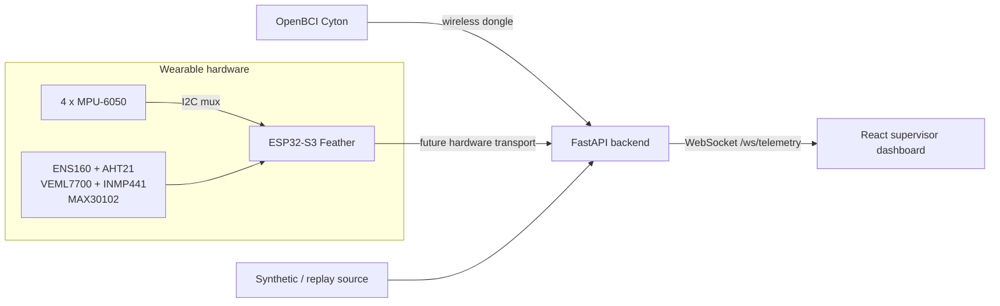

# T'Work It

T'Work It is a NatHacks 2026 worker-safety prototype that demonstrates a clean
path from wearable sensors to a supervisor dashboard. This repository is an
architecture scaffold: its telemetry is synthetic and its hardware adapters,
posture interpretation, EEG processing, and final visual design are intentionally
not implemented yet.

## Architecture



The browser only talks to FastAPI. The ESP32 will eventually estimate four
orientation quaternions; the laptop will own relative posture interpretation,
EEG acquisition, telemetry aggregation, and risk logic.

## Quick start

### Backend and built-in simulator

```bash
cd backend
python3 -m venv .venv
source .venv/bin/activate
pip install -r requirements.txt
uvicorn app.main:app --reload --host 0.0.0.0 --port 8000
```

Open `http://localhost:8000/health` to check the service. Every client connected
to `ws://localhost:8000/ws/telemetry` receives synthetic telemetry at about
20 Hz. To inspect the same simulator as newline-delimited JSON:

```bash
cd backend
source .venv/bin/activate
python -m app.simulator
```

### Frontend

```bash
cd frontend
cp .env.example .env
npm install
npm run dev
```

The default WebSocket URL is `ws://localhost:8000/ws/telemetry`. Override it
with `VITE_TELEMETRY_WS_URL` in `frontend/.env`.

### Firmware

Install [PlatformIO](https://platformio.org/), then:

```bash
cd firmware
pio run
pio run --target upload        # only when a board is connected
pio device monitor --baud 115200
```

The firmware build has no sensor-library dependencies and boots without any
peripherals attached. Its managers are lifecycle placeholders only.

## Repository map

- `firmware/` — modular PlatformIO/Arduino application scaffold.
- `backend/` — typed FastAPI models, health endpoint, WebSocket, and simulator.
- `frontend/` — Vite/React supervisor dashboard with a proof-of-life 3D view.
- `simulator/` — notes for the current synthetic source and future replay tools.
- `docs/` — product, architecture, telemetry, UI, and demo specifications.

No secrets or Wi-Fi credentials belong in this repository. Copy checked-in
`.env.example` files for local configuration.
