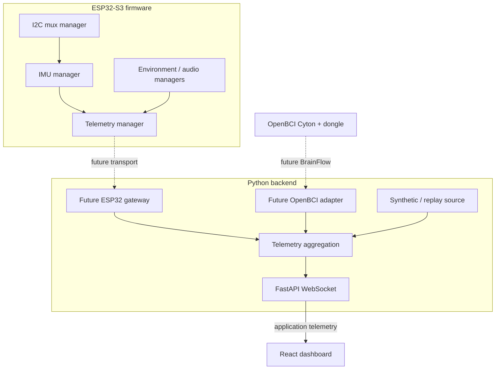

# Architecture

## Principles

- Hardware data enters through the Python backend; browsers never communicate
  directly with the ESP32 or OpenBCI.
- The ESP32 eventually performs time-sensitive device reads and computes one
  normalized orientation quaternion for each MPU-6050.
- Relative posture, cross-sensor interpretation, EEG processing, aggregation,
  and risk logic stay on the laptop.
- Frontend development must remain possible with synthetic or replayed data.
- Demo reliability and small, testable modules take priority over production
  infrastructure.

## Service boundaries

## Firmware

`firmware/src/main.cpp` owns application lifecycle only. Managers encapsulate
the I2C multiplexer, IMUs, environment sensors, audio monitoring, and outbound
telemetry. The scaffold initializes these components without touching hardware.
Future drivers can be introduced behind these boundaries.

The four IMUs map approximately to pelvis, lumbar, thoracic, and upper thoracic.
The future calibration flow records a neutral orientation for each. Device-side
orientation estimation produces quaternions; it does not decide whether posture
is safe.

## Backend

FastAPI is the sole browser-facing service. `GET /health` exposes a minimal
liveness response. `WS /ws/telemetry` currently creates a synthetic source per
connection and sends `WorkerTelemetry` messages at about 20 Hz. The typed model
is the boundary between future acquisition adapters and clients.

Later adapters may replace or feed the synthetic source without changing the
WebSocket contract: an ESP32 gateway, a BrainFlow/OpenBCI adapter, and
recorded-data replay.

## Frontend

The React application maintains a single WebSocket client, validates the minimal
message shape at the trust boundary, and places the latest sample in a Zustand
store. Dashboard components read from that store. React Three Fiber owns the 3D
proof-of-life view; it does not acquire hardware data or calculate posture.

## Failure and demo behavior

The frontend exposes connecting, connected, and disconnected states and retries
the WebSocket after a short delay. A backend or hardware disconnect must be
visible rather than silently displaying stale data. Simulated mode is explicitly
identified in telemetry so it cannot be mistaken for hardware acquisition.
