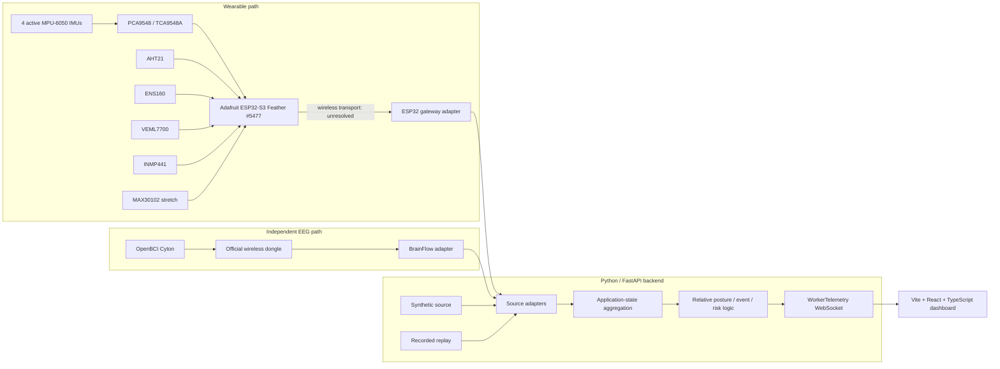

# System architecture

## Architectural commitments

- The browser communicates only with the Python backend.
- Four active MPU-6050 sensors connect to the ESP32-S3 through the I2C mux.
- The ESP32 will compute one normalized quaternion per IMU in `[w, x, y, z]`
  order; raw IMU/debug values may also be exposed when useful.
- The backend computes relative posture and higher-level interpretation.
- OpenBCI Cyton has a separate laptop acquisition path through BrainFlow. Raw EEG
  never routes through the ESP32.
- Live, synthetic, and recorded/replayed sources feed the same application-level
  `WorkerTelemetry` boundary.
- The frontend is hardware-source-agnostic and never handles device protocols or
  sensor register formats.
- The 3D view is a deterministic, sensor-driven posture approximation. Visual
  interpolation is not additional measured anatomy, and no physics engine
  determines posture.

## End-to-end data flow

## Responsibility boundaries

### ESP32 firmware

The Adafruit ESP32-S3 Feather owns hardware-facing, time-sensitive work:

- select mux channels and read four active MPU-6050 sensors;
- read the AHT21, ENS160, VEML7700, INMP441, and optionally MAX30102;
- eventually perform IMU fusion and emit one normalized quaternion per anchor;
- preserve the global `[w, x, y, z]` quaternion component order;
- provide timestamps/sequence information sufficient for the backend to detect
  stale or missing device data;
- expose raw acceleration/gyroscope/debug values only when useful; and
- accept a future neutral-calibration command when that transport is agreed.

FreeRTOS facilities may be used where they improve scheduling or isolation, but
are not required merely for architectural appearance. Firmware does not own
cross-sensor posture classification, EEG, dashboard state, or final risk logic.

The current firmware is a no-hardware scaffold: managers initialize without
sensor libraries or wireless transport.

### Python backend

FastAPI is the hardware gateway and single browser-facing authority. It owns:

- future ESP32 wireless transport and packet decoding;
- future BrainFlow/Cyton acquisition and EEG preprocessing;
- live, synthetic, and replay source adapters;
- conversion of source-specific values into stable application units;
- data freshness, connection status, aggregation, and `WorkerTelemetry` output;
- neutral-reference storage/orchestration and relative orientation calculations;
- posture, sustained-condition, fall/impact, alert, and combined-risk logic; and
- WebSocket delivery to the dashboard.

The backend may use NumPy/SciPy when concrete signal-processing needs arise.
BrainFlow is planned, not currently implemented. The current FastAPI scaffold
provides `GET /health` and `WS /ws/telemetry`, with one synthetic stream per
WebSocket client at approximately 20 Hz.

### Frontend

The Vite + React + TypeScript dashboard owns presentation and interaction:

- consume application-level `WorkerTelemetry` over WebSocket;
- store the latest application state in Zustand;
- render the 3D posture approximation with Three.js/React Three Fiber/Drei;
- visually interpolate between the four measured anchors, optionally using
  quaternion SLERP for smooth rendering;
- show connection/source state, alerts, timeline, calibration UX, EEG,
  environment, physiology, and overall risk; and
- request actions such as calibration/recenter through backend APIs once defined.

The frontend must not derive safety conclusions from raw sensors, depend on
BrainFlow, decode ESP32 packets, or invent values for missing telemetry. Planned
presentation tools include Tailwind CSS, shadcn/ui, Framer Motion, and possibly
uPlot and/or Recharts; they are not installed in the current scaffold. Vite must
not be replaced with Next.js or another web framework.

## Source abstraction and fallback behavior

Every source adapter should produce the same backend application state regardless
of origin:

- `hardware`: live ESP32 and/or Cyton adapters;
- `simulated`: deterministic synthetic development data;
- `replay`: recorded telemetry or prerecorded EEG; and
- manual demo event injection where explicitly enabled and visibly labelled.

Visual components receive normalized application fields and source/quality
metadata. They do not branch on hardware protocols. Partial live operation is
valid—for example, live wearable data plus prerecorded EEG—but each subsystem's
source and freshness must remain visible rather than being presented as wholly
live.

## Orientation and posture flow

1. Each active MPU-6050 supplies accelerometer and gyroscope data.
2. ESP32 fusion eventually produces four normalized absolute/device-frame
   orientation quaternions in `[w, x, y, z]` order.
3. The backend applies neutral references and sensor mounting transforms.
4. Relative orientations between adjacent anchors approximate segment bending.
5. Backend logic derives application-level posture values and alerts.
6. The frontend renders measured anchors and visually interpolates between them.

Because the MPU-6050 has no magnetometer, yaw drift is expected and accurate yaw
is not a primary requirement. Coordinate axes, quaternion direction
(sensor-to-world versus world-to-sensor), mounting transforms, and handedness
remain unresolved and must be settled before hardware integration.

## Calibration boundary

The intended interaction is initiated by the supervisor dashboard: stand
naturally upright, display a `3–2–1` countdown, capture neutral, confirm success,
and retain a smaller recenter action.

The frontend owns that interaction but not the calibration math. The backend
orchestrates calibration, validates freshness/completeness, and owns the active
application neutral state. The ESP32 may capture or persist the four reference
quaternions when commanded. Whether references live on the ESP32, backend, or
both, and the exact command/acknowledgement transport, are unresolved. The UI
must not claim success until the eventual backend workflow confirms it.

## Unresolved engineering decisions

- ESP32-to-backend wireless choice: Wi-Fi versus BLE and associated framing
- Low-level ESP32 packet schema, reliability, discovery, and clock synchronization
- Coordinate frame, handedness, quaternion direction, and mounting transforms
- Neutral-reference persistence and command/acknowledgement ownership
- Backend source-merging and resampling policy for different update rates
- EEG preprocessing, waveform downsampling, artifact metric, and PSD transport
- Event persistence and manual demo-trigger authorization
- Final posture thresholds, alert policy, and combined-risk calculation
